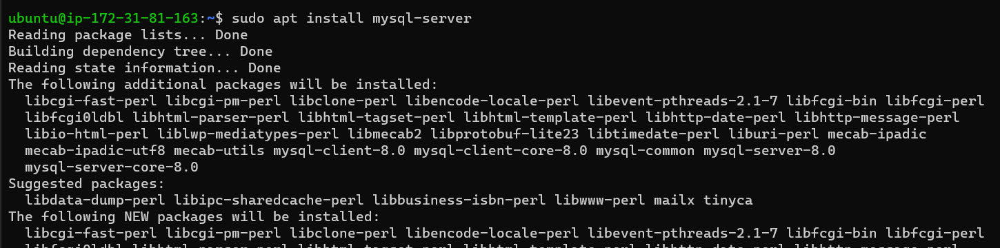
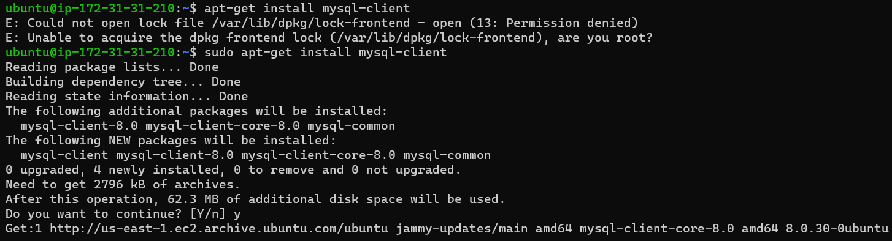
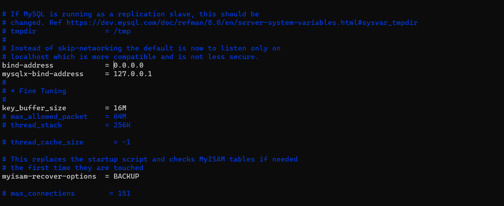
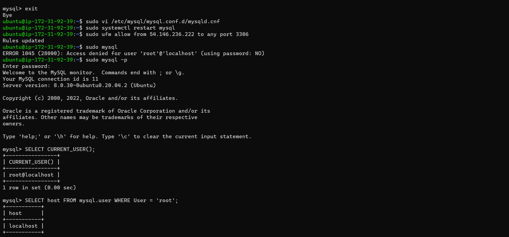
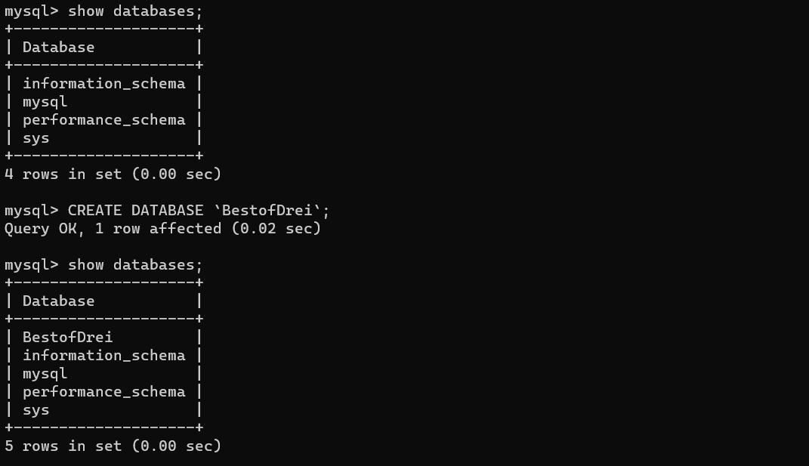
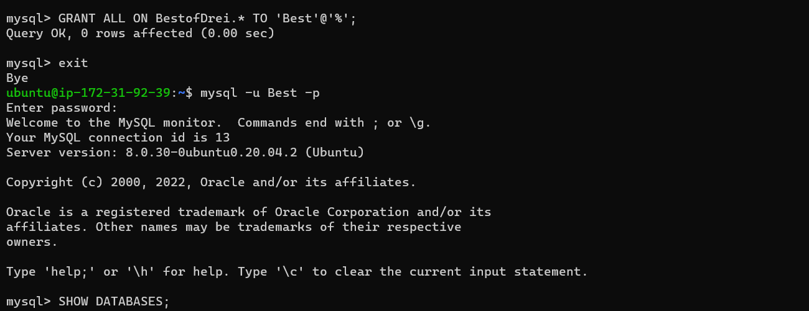
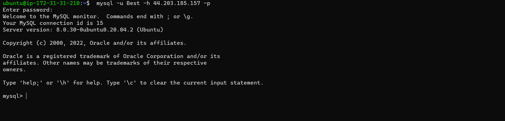
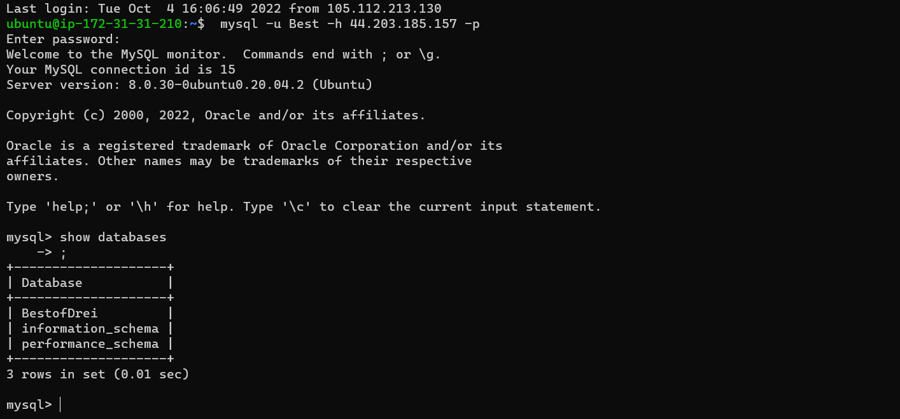

# CLIENT/SERVER ARCHITECTURE USING A MYSQL RELATIONAL DATABASE MANAGEMENT SYSTEM

## Client-server architecture with mysql

Create and configure two Linux-based virtual servers (EC2 instances in AWS).
Server A name - `mysql server`
Server B name - `mysql client`

On mysql server Linux Server install MySQL Server software

On mysql client Linux Server install MySQL Client software

`sudo vi /etc/mysql/mysql.conf.d/mysqld.cnf`

From mysql client Linux Server, connect remotely to mysql server Database Engine without using SSH.

## Server configuration 

New database

New user

Connection from client side

Show databases

